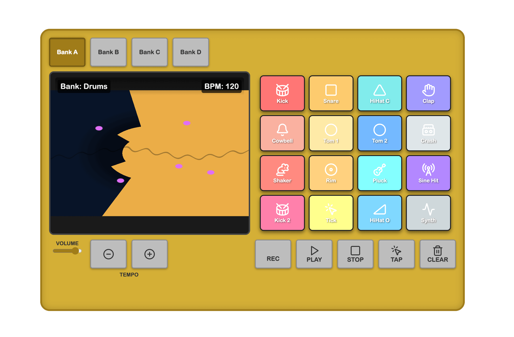

# Kid's Beat Maker

Inspired by the iconic Akai MPC, I've built (vibe-coded with Gemini 2.5 Pro) a super fun, interactive beat machine designed for little creators (ages 1-5)! 🎧👶

You can also try it out online here: https://g.co/gemini/share/686e1a14ef02

Watch your toddler tap into their inner musician with:

🌈 Colorful Light-Up Pads: Easy to tap, fun to watch!

🎵 Multiple Sound Banks: Switch between Drums, Animals, and fun FX!

💥 Reactive Visualizer: Trippy, cartoon-inspired graphics dance to the beat!

🔁 Simple Sequencer: Record and loop simple beats (REC/PLAY/STOP).

🎛️ Kid-Friendly Controls: Easy volume, tempo, and bank switching.

Built with HTML, CSS, JavaScript, Tone.js, Three.js, and ❤️. Runs right in your browser!

Let the jam session begin! 🎶